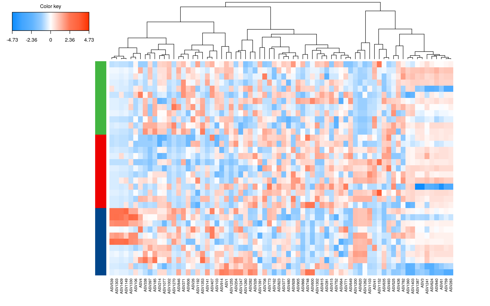

```{r echo=F, results='hide', message=F, warning=F,include=F}

dir.create("output/")
dir.create("output/2020_10_12/figures", recursive = TRUE)
dir.create("output/2020_10_12/tables", recursive = TRUE)

library(phyloseq)
library(microbiome)
library(tidyverse)
library(metagMisc)
library(dplyr)
library(compositions)
library(mixOmics)
library(vegan)
library(knitr)
library(ggpubr)
library(reshape2)
library(DT)
library(png)
library(grid)
library(ggplot2)
library(sva)
library("easyalluvial")
library(janitor)
source("src/pipline_function_16s.r" )
`%+%` <- function(a,b) {paste0(a,b)}
```

```{r include=F}
# load metadata

metat <- read.csv("data/gv009_onc_023_20201010.csv", fileEncoding="utf-8")
## cleaning

rownames(metat) <- metat$SampleID
metat$Groups<-factor(metat$Groups)
  
# load phyloseq
phy <- readRDS("data/ampliseq_phyloseq.rds")
```

## Objectives

There are two groups(gv009 and vehicle), three dosages(0mpk, 30mpk and 60mpk) and three drug batchs(201902, 201905, 201906) for this project.
<br/>
<br/>  	comparison of treatment of different dosages of gv009 on LLC tumor mice model (201902).

<br/>  	comparison of treatment of different dosages of gv009 on LLC tumor mice model (201905).

<br/>  	comparison of treatment of different dosages of gv009 on LLC tumor mice model (201906).

  
# Analysis detail

Analysis detail for selected projects from  project's 16S RNA sequencing data set

```{r echo=F, results='hide', message=F, warning=F,include=F}
# convert ASV sequence to ASV ID
phy <- convertSeq2ASV(phy)
# check rows
if (taxa_are_rows(phy) ==F) phy <- t(phy)

# color set
mycols <<- c(
  "#e6194b", "#3cb44b", "#4363d8", "#ffe119", "#f58231",
  "#911eb4", "#46f0f0", "#f032e6", "#bcf60c", "#fabebe",
  "#008080", "#e6beff", "#9a6324", "#fffac8", "#800000",
  "#aaffc3", "#808000", "#ffd8b1", "#000075", "#808080",
  "#000000"
)
#saveRDS(phy,file = "gv009_174samples_09_07_2020.rds")

# # order samples
# metat <- meta(phy)
# metat$order <- as.numeric(gsub("mpk","",metat$Dosage))
sample_data(phy) <- metat

# write.csv(metat,file = "data/09_07_2020/metadata_gv009_4projects.csv")

phy <- ordered_phy(phy = phy,group = "Groups")

```


### Data filtering
Low abundance taxa were filtered out
```{r filtering, message=F, warning=F,include=T}
filter <- phyloseq::genefilter_sample(phy, filterfun_sample(function(x) x >= 5))
phy_fil <- prune_taxa(filter, phy)
metat_fil <- meta(phy_fil)
phy_fil
```


### Prevalence
```{r }
phy_core <- core(phy_fil, detection = 0.0005, prevalence = .25)
metat_core <- meta(phy_core)
phy_core
```
Prevalence filter had big effect on data, only 299 taxa survived after 0.25 prevalence filtering

#### Taxa prevalence
```{r fig.height= 10, fig.width=10, fig.align='center',echo=T, message=F, warning=F}
ps.rar <- rarefy_even_depth(phy, sample.size =  min(sample_sums(phy)))
p.rar <- plot_taxa_prevalence(ps.rar, "Phylum")
p.rar

```

#### Samples size and taxa richness
```{r message=F,warning=F, fig.align="center",fig.width=10,fig.height=10}

##### Raw data
par(mfrow=c(1,2),family="inconsolata")
otu_tab <- t(abundances(phy))
p1 <- vegan::rarecurve(otu_tab, 
                      step = 100, label = T, 
                      col = "blue", cex = 0.6,main="all taxa")

##### Raw data
otu_tab <- t(abundances(phy_core))
p2 <- vegan::rarecurve(otu_tab, ylab = NULL,main="core taxa",
                      step = 100, label = T, 
                      col = "red", cex = 0.6)

par(mfrow=c(1,1))# reset
```
Sample X17774 are obviously different from other samples, so it is removed from phyloseq and meta table.

### Exploratory analysis

```{r  fig.height= 6, fig.width=8, fig.align='center',echo=T, results='hide', message=F, warning=F,include =T}
# delete sample X17774
s1 <- rownames(subset(meta(phy), SampleID != "X17774"))
phy <- prune_samples(s1, phy)
s2 <- rownames(subset(meta(phy_core), SampleID != "X17774"))
phy_core <- prune_samples(s1, phy_core)
metat_core <- meta(phy_core)
# CLR transformed data
pca_tab <- t(otu_table(phy_core)+1)
pca = mixOmics::pca(pca_tab, ncomp = 10, center = T, scale = F,logratio = "CLR")
par(family="sans")
plot(pca)
```

#### Dosage
```{r  fig.height= 6, fig.width=8, fig.align='center',echo=F, results='hide', message=F, warning=F,include =T}
par(family="sans")
mixOmics::plotIndiv(pca, comp=c(1,2), group = as.factor(metat_core$Dosage), ind.names = F, 
                    legend = TRUE, legend.title = "Dosage",
                    title = 'comp 1 - 2',
                    abline = T,
                    col.per.group=mycols[c(1:3)],
                    style = "graphics",
                    point.lwd = 2,
                    ellipse = F)

```
60 mpk are more obvious and there seem no difference between 0 mpk and 30 mpk.

#### Drug batch
```{r  fig.height= 8, fig.width=8, fig.align='center',echo=T, results='hide', message=F, warning=F,include =T}
par(family="inconsolata")
linshi<-metat_core
  Drug_batch_<-linshi$Drug_batch
  Drug_batch_[is.na(Drug_batch_)] <- "water"
mixOmics::plotIndiv(pca, comp=c(1,2), group = as.factor(Drug_batch_), ind.names = F,
                    legend = TRUE, legend.title = "Drug_batch",
                    title = 'comp 1 - 2',
                    abline = T,
                    col.per.group=mycols[c(1:4)],
                    style = "graphics",
                    point.lwd = 2,
                    ellipse = F)
```

#### Cage number
```{r  fig.height= 8, fig.width=10, fig.align='center',echo=F, results='hide', message=F, warning=F,include =T}
par(family="sans")
mixOmics::plotIndiv(pca, comp=c(1,2), group = as.factor(metat_core$Cage_num), ind.names = F, 
                    legend = TRUE, legend.title = "Cage number",
                    title = 'comp 1 - 2',
                    abline = T,
                    col.per.group=mycols[c(1:14)],
                    style = "graphics",
                    point.lwd = 2,
                    ellipse = F)
```

Cage effect is observed by PCA.

#### Drug batch + Dosage
```{r  fig.height= 8, fig.width=8, fig.align='center',echo=T, results='hide', message=F, warning=F,include =T}
par(family="inconsolata")
mixOmics::plotIndiv(pca, comp=c(1,2), group = as.factor(paste(metat_core$Dosage,metat_core$Drug_batch,sep="_")), ind.names = F,
                    legend = TRUE, legend.title = "Dosage + Drug_batch",
                    title = 'comp 1 - 2',
                    abline = T,
                    col.per.group=mycols[c(1:7)],
                    # col = c("yellow", "yellow","yellow", "yellow","yellow", "yellow", "yellow"),
                    style = "graphics",
                    point.lwd = 2,
                    ellipse = F)
```

Drug_batch is obviously observed by PCA.

```{r alpha fun,echo=F, results='hide', message=F, warning=F,include=F}
# create folder
dir.create("output/structure/figures/alpha", recursive = TRUE)
dir.create("output/structure/tables/alpha", recursive = TRUE)
```

### Drug batch (201902)
```{r , echo=F, message=F, warning=F}
drug_bash<-"201902"
phy_sub<-NULL
phy_sub <- subset_samples(phy, Drug_batch== drug_bash |is.na(Drug_batch))
meta_phy2<-meta(phy_sub)

phy_core_sub<-subset_samples(phy_core, Drug_batch== drug_bash |is.na(Drug_batch))

ps.alpha <- phy_sub
metat_alpha <- meta(ps.alpha)
metat_alpha$Dosage <- factor(paste0(metat_alpha$Dosage,"mpk"),level=c("0mpk","30mpk", "60mpk"))

sample_data(ps.alpha) <- metat_alpha

# get all index
div <- microbiome::alpha(ps.alpha,index="all")
write.csv(div,file = "output/structure/tables/alpha_index_table_all_dosage.csv")
write.csv(div,file = "output/structure/tables/alpha_index_table_all_dosage" %+% drug_bash %+% ".csv")
```

#### Alpha Diversity
##### Shannon
```{r fig.height= 8, fig.width=4, fig.align='center',echo=F, message=F, warning=F}
plot_alpha(input_phy=ps.alpha,selected_col = "Dosage",input_levels=c("0mpk","30mpk","60mpk"),div_type = "Shannon",
           outname = "output/structure/figures/alpha/alpha_shannon_all_dosage" %+% drug_bash %+% ".png",col = mycols[1:3],legend =F)
```


##### Richness
```{r fig.height= 8, fig.width=4, fig.align='center',echo=F, message=F, warning=F}
plot_alpha(input_phy=ps.alpha,selected_col = "Dosage",input_levels=c("0mpk","30mpk","60mpk"),div_type = "Chao1",
           outname = "output/structure/figures/alpha/alpha_chao1_all_dosage" %+% drug_bash %+% ".png",col = mycols[1:3],legend =F)
```

##### Eveness
```{r fig.height= 8, fig.width=4, fig.align='center',echo=F, message=F, warning=F}
plot_alpha(input_phy=ps.alpha,selected_col = "Dosage",input_levels=c("0mpk","30mpk","60mpk"),div_type = "Simpson",
           outname = "output/structure/figures/alpha/alpha_simpson_all_dosage" %+% drug_bash %+% ".png",col = mycols[1:3],legend =F)
```

#### Beta diversity
##### Density landscape
```{r fig.height= 5, fig.width=8, fig.align='center',echo=T, message=F, warning=F,results=T}
pseq.rel <- microbiome::transform(phy_core_sub, "compositional")
otu <- abundances(pseq.rel)
input_meta <- meta(pseq.rel)
input_meta$Dosage<-factor(input_meta$Dosage)
sample_data(pseq.rel) <- input_meta

# visualization landscape
p <- plot_landscape(pseq.rel, method = "NMDS", distance = "bray", col = "Dosage", size = 3)+
  labs(title="NMDS/Bray_Curtis")
print(p)

```

#### Community composition
```{r include=F, results='hide', message=F, warning=F}
dir.create("output/structure/figures/composition/")
```

##### Dosage at 0,30,60 mpk
```{r fig.height= 6, fig.width=5, fig.align='center',echo=T, message=F, warning=F}
ps.sel <- phy_core_sub
ps.sel@sam_data$Drug_batch <- as.factor(ps.sel@sam_data$Dosage )
# plot barplot for each taxon level
for (levels in c("Phylum","Class","Order","Family","Genus")){
  pseq <- ps.sel %>%
    aggregate_taxa(level = levels) %>%
    microbiome::transform(transform = "compositional") %>%
    aggregate_top_taxa(top = 10, levels)

  p.bar <- microbiome::plot_composition(pseq,  sample.sort = "Drug_batch",average_by = "Drug_batch") +
    scale_fill_manual(values = mycols) +
    guides(fill = guide_legend(ncol = 1)) +
    ylab("Relative Abundance (%)") +
    xlab("") +
    guides(fill = guide_legend(levels)) +
    theme_minimal() +
    theme(strip.text.x = element_text(size = 10, face = "bold")) +
    theme(text = element_text(size=10,family = "inconsolata")) +
    theme(axis.text.x = element_text(angle = 0, size = 10, face = "bold"))

  ggsave(p.bar, device="svg",
         filename =  paste0("output/structure/figures/composition/composition_top10_all.",levels,"" %+% drug_bash %+% ".svg"), 
         dpi = 300, height = 15, width = 13, units = "cm")
}
```

##### Phylum taxa composition
```{r out.height= "50%", out.width="50%",fig.align='center', message=F, warning=F,echo=F}
knitr::include_graphics("output/structure/figures/composition/composition_top10_all.Phylum" %+% drug_bash %+% ".svg")
```

##### Class level taxa composition

```{r out.height= "70%", out.width="50%",fig.align='center', message=F, warning=F,echo=F}
knitr::include_graphics("output/structure/figures/composition/composition_top10_all.Class" %+% drug_bash %+% ".svg")
```

##### Order level taxa composition

```{r fout.height= "70%", out.width="50%", fig.align='center', message=F, warning=F,echo=F}
knitr::include_graphics("output/structure/figures/composition/composition_top10_all.Order" %+% drug_bash %+% ".svg")
```

##### Family level taxa composition

```{r out.height= "70%", out.width="50%", fig.align='center', message=F, warning=F,echo=F}
knitr::include_graphics("output/structure/figures/composition/composition_top10_all.Family" %+% drug_bash %+% ".svg")
```

##### Genus level taxa composition

```{r oout.height= "50%", out.width="50%", fig.align='center', message=F, warning=F,echo=F}
knitr::include_graphics("output/structure/figures/composition/composition_top10_all.Genus" %+% drug_bash %+% ".svg")
```

#### sPLS-DA
##### data prepare for sPLA-DA
```{r , echo=F, message=F, warning=F}
ps.cluster1 <- subset_samples(phy_core_sub, Dosage == "0")
ps.cluster2 <- subset_samples(phy_core_sub, Dosage == "30")
ps.cluster3 <- subset_samples(phy_core_sub, Dosage == "60")
phy_core_sub <- merge_phyloseq(ps.cluster1, ps.cluster2, ps.cluster3)
data.raw <- t(otu_table(phy_core_sub))
Metadata <- phy_core_sub@sam_data
data.offset <- data.raw + 1
# filter using the function below
# function to perform pre-filtering
low.count.removal <- function(
  data, # OTU count data frame of size n (sample) x p (OTU)
  percent = 0.005 # cutoff chosen
) {
  keep.otu <- which(colSums(data) * 100 / (sum(colSums(data))) > percent)
  data.filter <- data[, keep.otu]
  return(list(data.filter = data.filter, keep.otu = keep.otu))
}
result.filter <- low.count.removal(data.offset, percent = 0.005)
Metadata$Dosage <- factor(Metadata$Dosage)
Tax <- tax_table(phy_core_sub)
Tax.filter <- Tax[unlist(result.filter$keep.otu), ]
data.filter <- result.filter$data.filter
X <- as.data.frame(data.filter)
Y <- Metadata$Dosage
```

#####sPLA-DA
```{r echo=T, results='hide', message=F, warning=F,include =T}
#############################################################  sPLS-DA #########################################################
dir.create("output/spls_da_201902",recursive = T)
# first, set a grid of values to test:
grid.keepX <- c(seq(5, 50, 5))
# if you dont understand what this means, type
# grid.keepX  # adjust this grid as necessary for your own data

# library(parallel)
# this chunk takes ~2 min to run
set.seed(100) # for reproducible results for this code, remove for your own code
gvri.tune.splsda <- tune.splsda(
  X = X,
  Y = Y,
  cpus = 8,
  ncomp = 3,
  logratio = "CLR",
  test.keepX = grid.keepX,
  validation = c("Mfold"),
  folds = 5,
  dist = "max.dist", # prediction distance can be chosen according to tune.plsda results
  nrepeat = 50,
  progressBar = T
)
# saveRDS(gvri.tune.splsda, file = "gvri.tune.splsda.rds")

# may show some convergence issues for some of the cases, it is ok for tuning

plot(gvri.tune.splsda)

# optimal number of variables to select on 2 comps:
select.keepX <- gvri.tune.splsda$choice.keepX[1:3]
select.keepX
# the sPLS-DA
gvri.splsda <- splsda(X = X, Y = Y, ncomp = 3, keepX = select.keepX, logratio = "CLR")

png(filename = "output/spls_da_201902/SPLSDA_12.png", width = 8, height = 6.5, units = "in", res = 300)
plotIndiv(gvri.splsda,
          comp = c(1, 2),
          ind.names = F,
          abline = T,
          style = "graphics",
          point.lwd = 2,
          ellipse = TRUE,
          legend = TRUE,
          col.per.group = ggsci::pal_lancet("lanonc")(9)[1:nlevels(as.factor(Metadata$Dosage))],
          title = "sPLS-DA comp 1-2")
dev.off()

png(filename = "output/spls_da_201902/sPLSDA_13.png", width = 8, height = 6.5, units = "in", res = 300)
plotIndiv(gvri.splsda,
          comp = c(1, 3),
          ind.names = F,
          abline = T,
          style = "graphics",
          point.lwd = 2,
          ellipse = TRUE,
          legend = TRUE,
          col.per.group = ggsci::pal_lancet("lanonc")(9)[1:nlevels(as.factor(Metadata$Dosage))],
          title = "sPLS-DA comp 1-3")
dev.off()

set.seed(200) # for reproducible results for this code, remove for your own code

gvri.perf.splsda <- perf(gvri.splsda,
                         validation = "Mfold", folds = 5,
                         progressBar = FALSE, nrepeat = 50, dist = "max.dist"
)

gvri.perf.splsda$error.rate
plot(gvri.perf.splsda)
# Tax.filter<-tax_table(ps.ordered)
#############################
tax_levels<-c("Genus")#"Phylum", "Order", "class", "Family", 
for (i in tax_levels) {
  
  # i<-"Genus"
  # browser()
  ############################
  name.var <- paste(Tax.filter[, i], colnames(X), sep = "|")
  #############################################n1
  res.splsda.plot<-NULL
  png(filename = paste0("output/spls_da_201902/",i, "_sPLSDA_comp1.png"), width = 8, height = 6.5, units = "in", res = 300)
  res.splsda.plot<- plotLoadings(gvri.splsda,
                                 comp = 1, method = "mean", contrib = "max",
                                 legend.color = ggsci::pal_lancet("lanonc")(9)[1:nlevels(as.factor(Metadata$Dosage))], name.var = name.var,
                                 size.title = 1.0, ndisplay = 50, size.name = .6, size.legend = 1.2 )
  dev.off()
  res.splsda.plot$SampleID = rownames(res.splsda.plot)
  p<-NULL
  n_componet<-1
  p<-spda_rere_plot(res.splsda.plot,Tax.filter,paste0('n',n_componet),i)#n_componet=2;i=Genus;
  # p
  ggsave(plot= p, filename = paste0("output/spls_da_201902/splda_",i,"_plot_n",n_componet,".png"), dpi = 300, height = 10, width = 10, units = "in")
  #
  write.table(res.splsda.plot, file = paste0("output/spls_da_201902/splda_",i,"_plot_n",n_componet,".xls"),sep = "\t", row.names = F,quote = F)
  #############################################n2
  res.splsda.plot<-NULL
  png(filename = paste0("output/spls_da_201902/",i, "_sPLSDA_comp2.png"), width = 8, height = 6.5, units = "in", res = 300)
  res.splsda.plot<-   plotLoadings(gvri.splsda,
                                   comp = 2, method = "mean", contrib = "max",
                                   legend.color = ggsci::pal_lancet("lanonc")(9)[1:nlevels(as.factor(Metadata$Dosage))], name.var = name.var,
                                   size.title = 1.0, ndisplay = 50, size.name = .6, size.legend = 1.2)
  dev.off()
  res.splsda.plot$SampleID = rownames(res.splsda.plot)
  p<-NULL
  n_componet<-2
  p<-spda_rere_plot(res.splsda.plot,Tax.filter,paste0('n',n_componet),i)#n_componet=2;i=Genus;
  # p
  ggsave(plot= p, filename = paste0("output/spls_da_201902/splda_",i,"_plot_n",n_componet,".png"), dpi = 300, height = 10, width = 10, units = "in")
  #
  write.table(res.splsda.plot, file = paste0("output/spls_da_201902/splda_",i,"_plot_n",n_componet,".xls"),sep = "\t", row.names = F,quote = F)
  #############################################n3
  res.splsda.plot<-NULL
  png(filename = paste0("output/spls_da_201902/",i, "_sPLSDA_comp3.png"), width = 8, height = 6.5, units = "in", res = 300)
  res.splsda.plot<-   plotLoadings(gvri.splsda,
                                   comp = 3, method = "mean", contrib = "max",
                                   legend.color = ggsci::pal_lancet("lanonc")(9)[1:nlevels(as.factor(Metadata$Dosage))], name.var = name.var,
                                   size.title = 1.0, ndisplay = 50, size.name = .6, size.legend = 1.2)
  dev.off()
  
  res.splsda.plot$SampleID = rownames(res.splsda.plot)
  p<-NULL
  n_componet<-3
  p<-spda_rere_plot(res.splsda.plot,Tax.filter,paste0('n',n_componet),i)#n_componet=2;i=Genus;
  # p
  ggsave(plot= p, filename = paste0("output/spls_da_201902/splda_",i,"_plot_n",n_componet,".png"), dpi = 300, height = 10, width = 10, units = "in")
  #
  write.table(res.splsda.plot, file = paste0("output/spls_da_201902/splda_",i,"_plot_n",n_componet,".xls"),sep = "\t", row.names = F,quote = F)
  
}

###############
####### redefine a color palette to make it consistent with the above color palette

color.gvri <- function(num.vector) {
  if (is.factor(num.vector)) {
    num.vector <- as.numeric(num.vector)
  }
  if (!is.numeric(num.vector)) {
    stop(paste("num.vector has to be numeric", call. = FALSE))
  }
  ##### lancet color palette
  mixo.col <- c("#00468BFF", "#ED0000FF", "#42B540FF", "#0099B4FF", "#925E9FFF", "#FDAF91FF", "#AD002AFF", "#ADB6B6FF", "#1B1919FF")
  n <- length(num.vector)
  if (isTRUE(num.vector) > length(mixo.col)) {
    stop(paste(
      "We only have a few mix.colors available, n <= ",
      length(mixo.col)
    ), call. = FALSE)
  }
  if (isTRUE(!is.finite((num.vector))) || (n < 1)) {
    stop("'num.vector' must be an integer vector with positive values.",
         call. = FALSE
    )
  }
  return(mixo.col[num.vector])
}

##################### Heatmap on outputs of sPLS-DA
png(filename = "output/spls_da_201902/Heatmap_comp1_comp2.png", width = 12, height = 7.5, units = "in", res = 300)
cim(gvri.splsda,
    row.sideColors = color.gvri(Y),
    cluster = "column",
    row.names = F,
    comp = c(1, 2), ## please make sure you choose the right number of components, or keep all components by unticking this line
    margins = c(5, 6),
    # color = colorRampPalette(c("#009E73","white","#E69F00"))(200),
    color = colorRampPalette(c("#0D8CFF", "#43A6FF", "#5EB3FF", "#93CCFF", "#FFFFFF", "#FFBBAA", "#FF7755", "#FF6039", "#FF3300"))(100) )
dev.off()


png(filename = "output/spls_da_201902/Heatmap_comp1_comp3.png", width = 12, height = 7.5, units = "in", res = 300)
cim(gvri.splsda,
    row.sideColors = color.gvri(Y),
    cluster = "column",
    row.names = F,
    comp = c(1, 3), ## please make sure you choose the right number of components, or keep all components by unticking this line
    margins = c(5, 6),
    # color = viridis::viridis(1000, option = "D") ## change the palette
    # color = colorRampPalette(c("#009E73","white","#E69F00"))(20),
    color = colorRampPalette(c("#0D8CFF", "#43A6FF", "#5EB3FF", "#93CCFF", "#FFFFFF", "#FFBBAA", "#FF7755", "#FF6039", "#FF3300"))(100) )
dev.off()


png(filename = "output/spls_da_201902/Heatmap_comp1_comp2_comp3.png", width = 12, height = 7.5, units = "in", res = 300)
cim(gvri.splsda,
    row.sideColors = color.gvri(Y),
    cluster = "column",
    # comp = c(1,2), ## please make sure you choose the right number of components, or keep all components by unticking this line
    margins = c(5, 6),
    row.names = F,
    # color = viridis::viridis(1000, option = "D") ## change the palette
    #  color = c( "#009E73","white","#E69F00")，
    # color = colorRampPalette(c("#009E73","white","#E69F00"))(20),
    # color = colorRampPalette(c("navy", "white", "firebrick3"))(100)
    color = colorRampPalette(c("#0D8CFF", "#43A6FF", "#5EB3FF", "#93CCFF", "#FFFFFF", "#FFBBAA", "#FF7755", "#FF6039", "#FF3300"))(100) )
dev.off()
```

```{r fig.height= 5, fig.width=5,fig.align='center', message=F, warning=F,echo=F}

```

```{r fig.height= 5, fig.width=5,fig.align='center', message=F, warning=F,echo=F}

```

```{r fig.height= 5, fig.width=5,fig.align='center', message=F, warning=F,echo=F}

```

```{r fig.height= 5, fig.width=5,fig.align='center', message=F, warning=F,echo=F}

```

```{r fig.height= 5, fig.width=5,fig.align='center', message=F, warning=F,echo=F}

```

```{r fig.height= 5, fig.width=5,fig.align='center', message=F, warning=F,echo=F}

```

```{r fig.height= 5, fig.width=5,fig.align='center', message=F, warning=F,echo=F}

```

```{r out.height= 5, fig.width=5,fig.align='center', message=F, warning=F,echo=F}
knitr::include_graphics("output/spls_da_201902/Heatmap_comp1_comp2_comp3.png")
```


#### Biomarker discovery - lefse

```{r  fig.height= 7, fig.width=7, fig.align='center',echo=F, results='hide', message=F, warning=F}
# prepare the input txtfile for lefse
dir.create("output/structure/figures/lefse", recursive = TRUE)
dir.create("output/structure/figures/lefse/phy_subset", recursive = TRUE)
dir.create("output/structure/tables/lefse", recursive = TRUE)
```

In our case, We split our data for pairwise comparison
 
###### 0mpk vs 30 mpk

```{r fig.height= 30, fig.width=25,  fig.align='center', warning=F}
   lefse_func(group1 = "0", group2 = "30", phy_new =phy_core_sub, ref = "0", group = "Dosage", batch = "201902")
```
There are significant difference in groups.


###### 0mpk vs 60 mpk

```{r fig.height= 30, fig.width=25,  fig.align='center', warning=F}
   lefse_func(group1 = "0", group2 = "60", phy_new =phy_core_sub, ref = "0", group = "Dosage", batch = "201902")
```
There are significant difference in groups.

###### 30mpk vs 60 mpk

```{r fig.height= 30, fig.width=25,  fig.align='center', warning=F}
   lefse_func(group1 = "30", group2 = "60", phy_new =phy_core_sub, ref = "30", group = "Dosage", batch = "201902")
```
There are significant difference in groups.


### Drug batch (201905)
```{r , echo=F, message=F, warning=F}
drug_bash<-"201905"
phy_sub<-NULL
phy_sub <- subset_samples(phy, Drug_batch== drug_bash |is.na(Drug_batch))
meta_phy2<-meta(phy_sub)

phy_core_sub<-subset_samples(phy_core, Drug_batch== drug_bash |is.na(Drug_batch))

ps.alpha <- phy_sub
metat_alpha <- meta(ps.alpha)
metat_alpha$Dosage <- factor(paste0(metat_alpha$Dosage,"mpk"),level=c("0mpk","30mpk", "60mpk"))

sample_data(ps.alpha) <- metat_alpha

# get all index
div <- microbiome::alpha(ps.alpha,index="all")
write.csv(div,file = "output/structure/tables/alpha_index_table_all_dosage.csv")
write.csv(div,file = "output/structure/tables/alpha_index_table_all_dosage" %+% drug_bash %+% ".csv")
```

#### Alpha Diversity
##### Shannon
```{r fig.height= 8, fig.width=4, fig.align='center',echo=F, message=F, warning=F}
plot_alpha(input_phy=ps.alpha,selected_col = "Dosage",input_levels=c("0mpk","30mpk","60mpk"),div_type = "Shannon",
           outname = "output/structure/figures/alpha/alpha_shannon_all_dosage" %+% drug_bash %+% ".png",col = mycols[1:3],legend =F)
```


##### Richness
```{r fig.height= 8, fig.width=4, fig.align='center',echo=F, message=F, warning=F}
plot_alpha(input_phy=ps.alpha,selected_col = "Dosage",input_levels=c("0mpk","30mpk","60mpk"),div_type = "Chao1",
           outname = "output/structure/figures/alpha/alpha_chao1_all_dosage" %+% drug_bash %+% ".png",col = mycols[1:3],legend =F)
```

##### Eveness
```{r fig.height= 8, fig.width=4, fig.align='center',echo=F, message=F, warning=F}
plot_alpha(input_phy=ps.alpha,selected_col = "Dosage",input_levels=c("0mpk","30mpk","60mpk"),div_type = "Simpson",
           outname = "output/structure/figures/alpha/alpha_simpson_all_dosage" %+% drug_bash %+% ".png",col = mycols[1:3],legend =F)
```

#### Beta diversity
##### Density landscape
```{r fig.height= 5, fig.width=8, fig.align='center',echo=T, message=F, warning=F,results=T}
pseq.rel <- microbiome::transform(phy_core_sub, "compositional")
otu <- abundances(pseq.rel)
input_meta <- meta(pseq.rel)
input_meta$Dosage<-factor(input_meta$Dosage)
sample_data(pseq.rel) <- input_meta

# visualization landscape
p <- plot_landscape(pseq.rel, method = "NMDS", distance = "bray", col = "Dosage", size = 3)+
  labs(title="NMDS/Bray_Curtis")
print(p)

```

#### Community composition
```{r include=F, results='hide', message=F, warning=F}
dir.create("output/structure/figures/composition/")
```

##### Dosage at 0,30,60 mpk
```{r fig.height= 6, fig.width=5, fig.align='center',echo=T, message=F, warning=F}
ps.sel <- phy_core_sub
ps.sel@sam_data$Drug_batch <- as.factor(ps.sel@sam_data$Dosage )
# plot barplot for each taxon level
for (levels in c("Phylum","Class","Order","Family","Genus")){
  pseq <- ps.sel %>%
    aggregate_taxa(level = levels) %>%
    microbiome::transform(transform = "compositional") %>%
    aggregate_top_taxa(top = 10, levels)
  
  p.bar <- microbiome::plot_composition(pseq,  sample.sort = "Drug_batch",average_by = "Drug_batch") +
    scale_fill_manual(values = mycols) +
    guides(fill = guide_legend(ncol = 1)) +
    ylab("Relative Abundance (%)") +
    xlab("") +
    guides(fill = guide_legend(levels)) +
    theme_minimal() +
    theme(strip.text.x = element_text(size = 10, face = "bold")) +
    theme(text = element_text(size=10,family = "inconsolata")) +
    theme(axis.text.x = element_text(angle = 0, size = 10, face = "bold"))
  
  ggsave(p.bar, device="svg",
         filename =  paste0("output/structure/figures/composition/composition_top10_all.",levels,"" %+% drug_bash %+% ".svg"), 
         dpi = 300, height = 15, width = 13, units = "cm")
}
```

##### Phylum taxa composition
```{r out.height= "50%", out.width="50%",fig.align='center', message=F, warning=F,echo=F}
knitr::include_graphics("output/structure/figures/composition/composition_top10_all.Phylum" %+% drug_bash %+% ".svg")
```

##### Class level taxa composition

```{r out.height= "70%", out.width="50%",fig.align='center', message=F, warning=F,echo=F}
knitr::include_graphics("output/structure/figures/composition/composition_top10_all.Class" %+% drug_bash %+% ".svg")
```

##### Order level taxa composition

```{r fout.height= "70%", out.width="50%", fig.align='center', message=F, warning=F,echo=F}
knitr::include_graphics("output/structure/figures/composition/composition_top10_all.Order" %+% drug_bash %+% ".svg")
```

##### Family level taxa composition

```{r out.height= "70%", out.width="50%", fig.align='center', message=F, warning=F,echo=F}
knitr::include_graphics("output/structure/figures/composition/composition_top10_all.Family" %+% drug_bash %+% ".svg")
```

##### Genus level taxa composition

```{r oout.height= "50%", out.width="50%", fig.align='center', message=F, warning=F,echo=F}
knitr::include_graphics("output/structure/figures/composition/composition_top10_all.Genus" %+% drug_bash %+% ".svg")
```

#### sPLS-DA
##### data prepare for sPLA-DA
```{r , echo=F, message=F, warning=F}
ps.cluster1 <- subset_samples(phy_core_sub, Dosage == "0")
ps.cluster2 <- subset_samples(phy_core_sub, Dosage == "30")
ps.cluster3 <- subset_samples(phy_core_sub, Dosage == "60")
phy_core_sub <- merge_phyloseq(ps.cluster1, ps.cluster2, ps.cluster3)
data.raw <- t(otu_table(phy_core_sub))
Metadata <- phy_core_sub@sam_data
data.offset <- data.raw + 1
# filter using the function below
# function to perform pre-filtering
low.count.removal <- function(
  data, # OTU count data frame of size n (sample) x p (OTU)
  percent = 0.005 # cutoff chosen
) {
  keep.otu <- which(colSums(data) * 100 / (sum(colSums(data))) > percent)
  data.filter <- data[, keep.otu]
  return(list(data.filter = data.filter, keep.otu = keep.otu))
}
result.filter <- low.count.removal(data.offset, percent = 0.005)
Metadata$Dosage <- factor(Metadata$Dosage)
Tax <- tax_table(phy_core_sub)
Tax.filter <- Tax[unlist(result.filter$keep.otu), ]
data.filter <- result.filter$data.filter
X <- as.data.frame(data.filter)
Y <- Metadata$Dosage
```

#####sPLA-DA
```{r echo=T, results='hide', message=F, warning=F,include =T}
#############################################################  sPLS-DA #########################################################
dir.create("output/spls_da_201905",recursive = T)
# first, set a grid of values to test:
grid.keepX <- c(seq(5, 50, 5))
# if you dont understand what this means, type
# grid.keepX  # adjust this grid as necessary for your own data

# library(parallel)
# this chunk takes ~2 min to run
set.seed(100) # for reproducible results for this code, remove for your own code
gvri.tune.splsda <- tune.splsda(
  X = X,
  Y = Y,
  cpus = 8,
  ncomp = 3,
  logratio = "CLR",
  test.keepX = grid.keepX,
  validation = c("Mfold"),
  folds = 5,
  dist = "max.dist", # prediction distance can be chosen according to tune.plsda results
  nrepeat = 50,
  progressBar = T
)
# saveRDS(gvri.tune.splsda, file = "gvri.tune.splsda.rds")

# may show some convergence issues for some of the cases, it is ok for tuning

plot(gvri.tune.splsda)

# optimal number of variables to select on 2 comps:
select.keepX <- gvri.tune.splsda$choice.keepX[1:3]
select.keepX
# the sPLS-DA
gvri.splsda <- splsda(X = X, Y = Y, ncomp = 3, keepX = select.keepX, logratio = "CLR")

png(filename = "output/spls_da_201905/SPLSDA_12.png", width = 8, height = 6.5, units = "in", res = 300)
plotIndiv(gvri.splsda,
          comp = c(1, 2),
          ind.names = F,
          abline = T,
          style = "graphics",
          point.lwd = 2,
          ellipse = TRUE,
          legend = TRUE,
          col.per.group = ggsci::pal_lancet("lanonc")(9)[1:nlevels(as.factor(Metadata$Dosage))],
          title = "sPLS-DA comp 1-2")
dev.off()

png(filename = "output/spls_da_201905/sPLSDA_13.png", width = 8, height = 6.5, units = "in", res = 300)
plotIndiv(gvri.splsda,
          comp = c(1, 3),
          ind.names = F,
          abline = T,
          style = "graphics",
          point.lwd = 2,
          ellipse = TRUE,
          legend = TRUE,
          col.per.group = ggsci::pal_lancet("lanonc")(9)[1:nlevels(as.factor(Metadata$Dosage))],
          title = "sPLS-DA comp 1-3")
dev.off()

set.seed(200) # for reproducible results for this code, remove for your own code

gvri.perf.splsda <- perf(gvri.splsda,
                         validation = "Mfold", folds = 5,
                         progressBar = FALSE, nrepeat = 50, dist = "max.dist"
)

gvri.perf.splsda$error.rate
plot(gvri.perf.splsda)
# Tax.filter<-tax_table(ps.ordered)
#############################
tax_levels<-c("Genus")#"Phylum", "Order", "class", "Family", 
for (i in tax_levels) {
  
  # i<-"Genus"
  # browser()
  ############################
  name.var <- paste(Tax.filter[, i], colnames(X), sep = "|")
  #############################################n1
  res.splsda.plot<-NULL
  png(filename = paste0("output/spls_da_201905/",i, "_sPLSDA_comp1.png"), width = 8, height = 6.5, units = "in", res = 300)
  res.splsda.plot<- plotLoadings(gvri.splsda,
                                 comp = 1, method = "mean", contrib = "max",
                                 legend.color = ggsci::pal_lancet("lanonc")(9)[1:nlevels(as.factor(Metadata$Dosage))], name.var = name.var,
                                 size.title = 1.0, ndisplay = 50, size.name = .6, size.legend = 1.2 )
  dev.off()
  res.splsda.plot$SampleID = rownames(res.splsda.plot)
  p<-NULL
  n_componet<-1
  p<-spda_rere_plot(res.splsda.plot,Tax.filter,paste0('n',n_componet),i)#n_componet=2;i=Genus;
  # p
  ggsave(plot= p, filename = paste0("output/spls_da_201905/splda_",i,"_plot_n",n_componet,".png"), dpi = 300, height = 10, width = 10, units = "in")
  #
  write.table(res.splsda.plot, file = paste0("output/spls_da_201905/splda_",i,"_plot_n",n_componet,".xls"),sep = "\t", row.names = F,quote = F)
  #############################################n2
  res.splsda.plot<-NULL
  png(filename = paste0("output/spls_da_201905/",i, "_sPLSDA_comp2.png"), width = 8, height = 6.5, units = "in", res = 300)
  res.splsda.plot<-   plotLoadings(gvri.splsda,
                                   comp = 2, method = "mean", contrib = "max",
                                   legend.color = ggsci::pal_lancet("lanonc")(9)[1:nlevels(as.factor(Metadata$Dosage))], name.var = name.var,
                                   size.title = 1.0, ndisplay = 50, size.name = .6, size.legend = 1.2)
  dev.off()
  res.splsda.plot$SampleID = rownames(res.splsda.plot)
  p<-NULL
  n_componet<-2
  p<-spda_rere_plot(res.splsda.plot,Tax.filter,paste0('n',n_componet),i)#n_componet=2;i=Genus;
  # p
  ggsave(plot= p, filename = paste0("output/spls_da_201905/splda_",i,"_plot_n",n_componet,".png"), dpi = 300, height = 10, width = 10, units = "in")
  #
  write.table(res.splsda.plot, file = paste0("output/spls_da_201905/splda_",i,"_plot_n",n_componet,".xls"),sep = "\t", row.names = F,quote = F)
  #############################################n3
  res.splsda.plot<-NULL
  png(filename = paste0("output/spls_da_201905/",i, "_sPLSDA_comp3.png"), width = 8, height = 6.5, units = "in", res = 300)
  res.splsda.plot<-   plotLoadings(gvri.splsda,
                                   comp = 3, method = "mean", contrib = "max",
                                   legend.color = ggsci::pal_lancet("lanonc")(9)[1:nlevels(as.factor(Metadata$Dosage))], name.var = name.var,
                                   size.title = 1.0, ndisplay = 50, size.name = .6, size.legend = 1.2)
  dev.off()
  
  res.splsda.plot$SampleID = rownames(res.splsda.plot)
  p<-NULL
  n_componet<-3
  p<-spda_rere_plot(res.splsda.plot,Tax.filter,paste0('n',n_componet),i)#n_componet=2;i=Genus;
  # p
  ggsave(plot= p, filename = paste0("output/spls_da_201905/splda_",i,"_plot_n",n_componet,".png"), dpi = 300, height = 10, width = 10, units = "in")
  #
  write.table(res.splsda.plot, file = paste0("output/spls_da_201905/splda_",i,"_plot_n",n_componet,".xls"),sep = "\t", row.names = F,quote = F)
  
}

###############
####### redefine a color palette to make it consistent with the above color palette

color.gvri <- function(num.vector) {
  if (is.factor(num.vector)) {
    num.vector <- as.numeric(num.vector)
  }
  if (!is.numeric(num.vector)) {
    stop(paste("num.vector has to be numeric", call. = FALSE))
  }
  ##### lancet color palette
  mixo.col <- c("#00468BFF", "#ED0000FF", "#42B540FF", "#0099B4FF", "#925E9FFF", "#FDAF91FF", "#AD002AFF", "#ADB6B6FF", "#1B1919FF")
  n <- length(num.vector)
  if (isTRUE(num.vector) > length(mixo.col)) {
    stop(paste(
      "We only have a few mix.colors available, n <= ",
      length(mixo.col)
    ), call. = FALSE)
  }
  if (isTRUE(!is.finite((num.vector))) || (n < 1)) {
    stop("'num.vector' must be an integer vector with positive values.",
         call. = FALSE
    )
  }
  return(mixo.col[num.vector])
}

##################### Heatmap on outputs of sPLS-DA
png(filename = "output/spls_da_201905/Heatmap_comp1_comp2.png", width = 12, height = 7.5, units = "in", res = 300)
cim(gvri.splsda,
    row.sideColors = color.gvri(Y),
    cluster = "column",
    row.names = F,
    comp = c(1, 2), ## please make sure you choose the right number of components, or keep all components by unticking this line
    margins = c(5, 6),
    # color = colorRampPalette(c("#009E73","white","#E69F00"))(200),
    color = colorRampPalette(c("#0D8CFF", "#43A6FF", "#5EB3FF", "#93CCFF", "#FFFFFF", "#FFBBAA", "#FF7755", "#FF6039", "#FF3300"))(100) )
dev.off()


png(filename = "output/spls_da_201905/Heatmap_comp1_comp3.png", width = 12, height = 7.5, units = "in", res = 300)
cim(gvri.splsda,
    row.sideColors = color.gvri(Y),
    cluster = "column",
    row.names = F,
    comp = c(1, 3), ## please make sure you choose the right number of components, or keep all components by unticking this line
    margins = c(5, 6),
    # color = viridis::viridis(1000, option = "D") ## change the palette
    # color = colorRampPalette(c("#009E73","white","#E69F00"))(20),
    color = colorRampPalette(c("#0D8CFF", "#43A6FF", "#5EB3FF", "#93CCFF", "#FFFFFF", "#FFBBAA", "#FF7755", "#FF6039", "#FF3300"))(100) )
dev.off()


png(filename = "output/spls_da_201905/Heatmap_comp1_comp2_comp3.png", width = 12, height = 7.5, units = "in", res = 300)
cim(gvri.splsda,
    row.sideColors = color.gvri(Y),
    cluster = "column",
    # comp = c(1,2), ## please make sure you choose the right number of components, or keep all components by unticking this line
    margins = c(5, 6),
    row.names = F,
    # color = viridis::viridis(1000, option = "D") ## change the palette
    #  color = c( "#009E73","white","#E69F00")，
    # color = colorRampPalette(c("#009E73","white","#E69F00"))(20),
    # color = colorRampPalette(c("navy", "white", "firebrick3"))(100)
    color = colorRampPalette(c("#0D8CFF", "#43A6FF", "#5EB3FF", "#93CCFF", "#FFFFFF", "#FFBBAA", "#FF7755", "#FF6039", "#FF3300"))(100) )
dev.off()
```

```{r fig.height= 5, fig.width=5,fig.align='center', message=F, warning=F,echo=F}

```
```{r fig.height= 5, fig.width=5,fig.align='center', message=F, warning=F,echo=F}

```
```{r fig.height= 5, fig.width=5,fig.align='center', message=F, warning=F,echo=F}

```
```{r fig.height= 5, fig.width=5,fig.align='center', message=F, warning=F,echo=F}

```
```{r fig.height= 5, fig.width=5,fig.align='center', message=F, warning=F,echo=F}

```

```{r fig.height= 5, fig.width=5,fig.align='center', message=F, warning=F,echo=F}

```
```{r fig.height= 5, fig.width=5,fig.align='center', message=F, warning=F,echo=F}

```
```{r fig.height= 5, fig.width=5,fig.align='center', message=F, warning=F,echo=F}

```


#### Biomarker discovery - lefse

```{r  fig.height= 7, fig.width=7, fig.align='center',echo=F, results='hide', message=F, warning=F}
# prepare the input txtfile for lefse
dir.create("output/structure/figures/lefse", recursive = TRUE)
dir.create("output/structure/figures/lefse/phy_subset", recursive = TRUE)
dir.create("output/structure/tables/lefse", recursive = TRUE)
```

In our case, We split our data for pairwise comparison

###### 0mpk vs 30 mpk

```{r fig.height= 30, fig.width=25,  fig.align='center', warning=F}
lefse_func(group1 = "0", group2 = "30", phy_new =phy_core_sub, ref = "0", group = "Dosage", batch = "201905")
```
There are significant difference in groups.


###### 0mpk vs 60 mpk

```{r fig.height= 30, fig.width=25,  fig.align='center', warning=F}
lefse_func(group1 = "0", group2 = "60", phy_new =phy_core_sub, ref = "0", group = "Dosage", batch = "201905")
```
There are significant difference in groups.

###### 30mpk vs 60 mpk

```{r fig.height= 30, fig.width=25,  fig.align='center', warning=F}
lefse_func(group1 = "30", group2 = "60", phy_new =phy_core_sub, ref = "30", group = "Dosage", batch = "201905")
```
There are significant difference in groups.


### Drug batch (201906)
```{r , echo=F, message=F, warning=F}
drug_bash<-"201906"
phy_sub<-NULL
phy_sub <- subset_samples(phy, Drug_batch== drug_bash |is.na(Drug_batch))
meta_phy2<-meta(phy_sub)

phy_core_sub<-subset_samples(phy_core, Drug_batch== drug_bash |is.na(Drug_batch))

ps.alpha <- phy_sub
metat_alpha <- meta(ps.alpha)
metat_alpha$Dosage <- factor(paste0(metat_alpha$Dosage,"mpk"),level=c("0mpk","30mpk", "60mpk"))

sample_data(ps.alpha) <- metat_alpha

# get all index
div <- microbiome::alpha(ps.alpha,index="all")
write.csv(div,file = "output/structure/tables/alpha_index_table_all_dosage.csv")
write.csv(div,file = "output/structure/tables/alpha_index_table_all_dosage" %+% drug_bash %+% ".csv")
```

#### Alpha Diversity
##### Shannon
```{r fig.height= 8, fig.width=4, fig.align='center',echo=F, message=F, warning=F}
plot_alpha(input_phy=ps.alpha,selected_col = "Dosage",input_levels=c("0mpk","30mpk","60mpk"),div_type = "Shannon",
           outname = "output/structure/figures/alpha/alpha_shannon_all_dosage" %+% drug_bash %+% ".png",col = mycols[1:3],legend =F)
```


##### Richness
```{r fig.height= 8, fig.width=4, fig.align='center',echo=F, message=F, warning=F}
plot_alpha(input_phy=ps.alpha,selected_col = "Dosage",input_levels=c("0mpk","30mpk","60mpk"),div_type = "Chao1",
           outname = "output/structure/figures/alpha/alpha_chao1_all_dosage" %+% drug_bash %+% ".png",col = mycols[1:3],legend =F)
```

##### Eveness
```{r fig.height= 8, fig.width=4, fig.align='center',echo=F, message=F, warning=F}
plot_alpha(input_phy=ps.alpha,selected_col = "Dosage",input_levels=c("0mpk","30mpk","60mpk"),div_type = "Simpson",
           outname = "output/structure/figures/alpha/alpha_simpson_all_dosage" %+% drug_bash %+% ".png",col = mycols[1:3],legend =F)
```

#### Beta diversity
##### Density landscape
```{r fig.height= 5, fig.width=8, fig.align='center',echo=T, message=F, warning=F,results=T}
pseq.rel <- microbiome::transform(phy_core_sub, "compositional")
otu <- abundances(pseq.rel)
input_meta <- meta(pseq.rel)
input_meta$Dosage<-factor(input_meta$Dosage)
sample_data(pseq.rel) <- input_meta

# visualization landscape
p <- plot_landscape(pseq.rel, method = "NMDS", distance = "bray", col = "Dosage", size = 3)+
  labs(title="NMDS/Bray_Curtis")
print(p)

```

#### Community composition
```{r include=F, results='hide', message=F, warning=F}
dir.create("output/structure/figures/composition/")
```

##### Dosage at 0,30,60 mpk
```{r fig.height= 6, fig.width=5, fig.align='center',echo=T, message=F, warning=F}
ps.sel <- phy_core_sub
ps.sel@sam_data$Drug_batch <- as.factor(ps.sel@sam_data$Dosage )
# plot barplot for each taxon level
for (levels in c("Phylum","Class","Order","Family","Genus")){
  pseq <- ps.sel %>%
    aggregate_taxa(level = levels) %>%
    microbiome::transform(transform = "compositional") %>%
    aggregate_top_taxa(top = 10, levels)
  
  p.bar <- microbiome::plot_composition(pseq,  sample.sort = "Drug_batch",average_by = "Drug_batch") +
    scale_fill_manual(values = mycols) +
    guides(fill = guide_legend(ncol = 1)) +
    ylab("Relative Abundance (%)") +
    xlab("") +
    guides(fill = guide_legend(levels)) +
    theme_minimal() +
    theme(strip.text.x = element_text(size = 10, face = "bold")) +
    theme(text = element_text(size=10,family = "inconsolata")) +
    theme(axis.text.x = element_text(angle = 0, size = 10, face = "bold"))
  
  ggsave(p.bar, device="svg",
         filename =  paste0("output/structure/figures/composition/composition_top10_all.",levels,"" %+% drug_bash %+% ".svg"), 
         dpi = 300, height = 15, width = 13, units = "cm")
}
```

##### Phylum taxa composition
```{r out.height= "50%", out.width="50%",fig.align='center', message=F, warning=F,echo=F}
knitr::include_graphics("output/structure/figures/composition/composition_top10_all.Phylum" %+% drug_bash %+% ".svg")
```

##### Class level taxa composition

```{r out.height= "70%", out.width="50%",fig.align='center', message=F, warning=F,echo=F}
knitr::include_graphics("output/structure/figures/composition/composition_top10_all.Class" %+% drug_bash %+% ".svg")
```

##### Order level taxa composition

```{r fout.height= "70%", out.width="50%", fig.align='center', message=F, warning=F,echo=F}
knitr::include_graphics("output/structure/figures/composition/composition_top10_all.Order" %+% drug_bash %+% ".svg")
```

##### Family level taxa composition

```{r out.height= "70%", out.width="50%", fig.align='center', message=F, warning=F,echo=F}
knitr::include_graphics("output/structure/figures/composition/composition_top10_all.Family" %+% drug_bash %+% ".svg")
```

##### Genus level taxa composition

```{r oout.height= "50%", out.width="50%", fig.align='center', message=F, warning=F,echo=F}
knitr::include_graphics("output/structure/figures/composition/composition_top10_all.Genus" %+% drug_bash %+% ".svg")
```

#### sPLS-DA
##### data prepare for sPLA-DA
```{r , echo=F, message=F, warning=F}
ps.cluster1 <- subset_samples(phy_core_sub, Dosage == "0")
ps.cluster2 <- subset_samples(phy_core_sub, Dosage == "30")
ps.cluster3 <- subset_samples(phy_core_sub, Dosage == "60")
phy_core_sub <- merge_phyloseq(ps.cluster1, ps.cluster2, ps.cluster3)
data.raw <- t(otu_table(phy_core_sub))
Metadata <- phy_core_sub@sam_data
data.offset <- data.raw + 1
# filter using the function below
# function to perform pre-filtering
low.count.removal <- function(
  data, # OTU count data frame of size n (sample) x p (OTU)
  percent = 0.005 # cutoff chosen
) {
  keep.otu <- which(colSums(data) * 100 / (sum(colSums(data))) > percent)
  data.filter <- data[, keep.otu]
  return(list(data.filter = data.filter, keep.otu = keep.otu))
}
result.filter <- low.count.removal(data.offset, percent = 0.005)
Metadata$Dosage <- factor(Metadata$Dosage)
Tax <- tax_table(phy_core_sub)
Tax.filter <- Tax[unlist(result.filter$keep.otu), ]
data.filter <- result.filter$data.filter
X <- as.data.frame(data.filter)
Y <- Metadata$Dosage
```

#####sPLA-DA
```{r echo=T, results='hide', message=F, warning=F,include =T}
#############################################################  sPLS-DA #########################################################
dir.create("output/spls_da_201906",recursive = T)
# first, set a grid of values to test:
grid.keepX <- c(seq(5, 50, 5))
# if you dont understand what this means, type
# grid.keepX  # adjust this grid as necessary for your own data

# library(parallel)
# this chunk takes ~2 min to run
set.seed(100) # for reproducible results for this code, remove for your own code
gvri.tune.splsda <- tune.splsda(
  X = X,
  Y = Y,
  cpus = 8,
  ncomp = 3,
  logratio = "CLR",
  test.keepX = grid.keepX,
  validation = c("Mfold"),
  folds = 5,
  dist = "max.dist", # prediction distance can be chosen according to tune.plsda results
  nrepeat = 50,
  progressBar = T
)
# saveRDS(gvri.tune.splsda, file = "gvri.tune.splsda.rds")

# may show some convergence issues for some of the cases, it is ok for tuning

plot(gvri.tune.splsda)

# optimal number of variables to select on 2 comps:
select.keepX <- gvri.tune.splsda$choice.keepX[1:3]
select.keepX
# the sPLS-DA
gvri.splsda <- splsda(X = X, Y = Y, ncomp = 3, keepX = select.keepX, logratio = "CLR")

png(filename = "output/spls_da_201906/SPLSDA_12.png", width = 8, height = 6.5, units = "in", res = 300)
plotIndiv(gvri.splsda,
          comp = c(1, 2),
          ind.names = F,
          abline = T,
          style = "graphics",
          point.lwd = 2,
          ellipse = TRUE,
          legend = TRUE,
          col.per.group = ggsci::pal_lancet("lanonc")(9)[1:nlevels(as.factor(Metadata$Dosage))],
          title = "sPLS-DA comp 1-2")
dev.off()

png(filename = "output/spls_da_201906/sPLSDA_13.png", width = 8, height = 6.5, units = "in", res = 300)
plotIndiv(gvri.splsda,
          comp = c(1, 3),
          ind.names = F,
          abline = T,
          style = "graphics",
          point.lwd = 2,
          ellipse = TRUE,
          legend = TRUE,
          col.per.group = ggsci::pal_lancet("lanonc")(9)[1:nlevels(as.factor(Metadata$Dosage))],
          title = "sPLS-DA comp 1-3")
dev.off()

set.seed(200) # for reproducible results for this code, remove for your own code

gvri.perf.splsda <- perf(gvri.splsda,
                         validation = "Mfold", folds = 5,
                         progressBar = FALSE, nrepeat = 50, dist = "max.dist"
)

gvri.perf.splsda$error.rate
plot(gvri.perf.splsda)
# Tax.filter<-tax_table(ps.ordered)
#############################
tax_levels<-c("Genus")#"Phylum", "Order", "class", "Family", 
for (i in tax_levels) {
  
  # i<-"Genus"
  # browser()
  ############################
  name.var <- paste(Tax.filter[, i], colnames(X), sep = "|")
  #############################################n1
  res.splsda.plot<-NULL
  png(filename = paste0("output/spls_da_201906/",i, "_sPLSDA_comp1.png"), width = 8, height = 6.5, units = "in", res = 300)
  res.splsda.plot<- plotLoadings(gvri.splsda,
                                 comp = 1, method = "mean", contrib = "max",
                                 legend.color = ggsci::pal_lancet("lanonc")(9)[1:nlevels(as.factor(Metadata$Dosage))], name.var = name.var,
                                 size.title = 1.0, ndisplay = 50, size.name = .6, size.legend = 1.2 )
  dev.off()
  res.splsda.plot$SampleID = rownames(res.splsda.plot)
  p<-NULL
  n_componet<-1
  p<-spda_rere_plot(res.splsda.plot,Tax.filter,paste0('n',n_componet),i)#n_componet=2;i=Genus;
  # p
  ggsave(plot= p, filename = paste0("output/spls_da_201906/splda_",i,"_plot_n",n_componet,".png"), dpi = 300, height = 10, width = 10, units = "in")
  #
  write.table(res.splsda.plot, file = paste0("output/spls_da_201906/splda_",i,"_plot_n",n_componet,".xls"),sep = "\t", row.names = F,quote = F)
  #############################################n2
  res.splsda.plot<-NULL
  png(filename = paste0("output/spls_da_201906/",i, "_sPLSDA_comp2.png"), width = 8, height = 6.5, units = "in", res = 300)
  res.splsda.plot<-   plotLoadings(gvri.splsda,
                                   comp = 2, method = "mean", contrib = "max",
                                   legend.color = ggsci::pal_lancet("lanonc")(9)[1:nlevels(as.factor(Metadata$Dosage))], name.var = name.var,
                                   size.title = 1.0, ndisplay = 50, size.name = .6, size.legend = 1.2)
  dev.off()
  res.splsda.plot$SampleID = rownames(res.splsda.plot)
  p<-NULL
  n_componet<-2
  p<-spda_rere_plot(res.splsda.plot,Tax.filter,paste0('n',n_componet),i)#n_componet=2;i=Genus;
  # p
  ggsave(plot= p, filename = paste0("output/spls_da_201906/splda_",i,"_plot_n",n_componet,".png"), dpi = 300, height = 10, width = 10, units = "in")
  #
  write.table(res.splsda.plot, file = paste0("output/spls_da_201906/splda_",i,"_plot_n",n_componet,".xls"),sep = "\t", row.names = F,quote = F)
  #############################################n3
  res.splsda.plot<-NULL
  png(filename = paste0("output/spls_da_201906/",i, "_sPLSDA_comp3.png"), width = 8, height = 6.5, units = "in", res = 300)
  res.splsda.plot<-   plotLoadings(gvri.splsda,
                                   comp = 3, method = "mean", contrib = "max",
                                   legend.color = ggsci::pal_lancet("lanonc")(9)[1:nlevels(as.factor(Metadata$Dosage))], name.var = name.var,
                                   size.title = 1.0, ndisplay = 50, size.name = .6, size.legend = 1.2)
  dev.off()
  
  res.splsda.plot$SampleID = rownames(res.splsda.plot)
  p<-NULL
  n_componet<-3
  p<-spda_rere_plot(res.splsda.plot,Tax.filter,paste0('n',n_componet),i)#n_componet=2;i=Genus;
  # p
  ggsave(plot= p, filename = paste0("output/spls_da_201906/splda_",i,"_plot_n",n_componet,".png"), dpi = 300, height = 10, width = 10, units = "in")
  #
  write.table(res.splsda.plot, file = paste0("output/spls_da_201906/splda_",i,"_plot_n",n_componet,".xls"),sep = "\t", row.names = F,quote = F)
  
}

###############
####### redefine a color palette to make it consistent with the above color palette

color.gvri <- function(num.vector) {
  if (is.factor(num.vector)) {
    num.vector <- as.numeric(num.vector)
  }
  if (!is.numeric(num.vector)) {
    stop(paste("num.vector has to be numeric", call. = FALSE))
  }
  ##### lancet color palette
  mixo.col <- c("#00468BFF", "#ED0000FF", "#42B540FF", "#0099B4FF", "#925E9FFF", "#FDAF91FF", "#AD002AFF", "#ADB6B6FF", "#1B1919FF")
  n <- length(num.vector)
  if (isTRUE(num.vector) > length(mixo.col)) {
    stop(paste(
      "We only have a few mix.colors available, n <= ",
      length(mixo.col)
    ), call. = FALSE)
  }
  if (isTRUE(!is.finite((num.vector))) || (n < 1)) {
    stop("'num.vector' must be an integer vector with positive values.",
         call. = FALSE
    )
  }
  return(mixo.col[num.vector])
}

##################### Heatmap on outputs of sPLS-DA
png(filename = "output/spls_da_201906/Heatmap_comp1_comp2.png", width = 12, height = 7.5, units = "in", res = 300)
cim(gvri.splsda,
    row.sideColors = color.gvri(Y),
    cluster = "column",
    row.names = F,
    comp = c(1, 2), ## please make sure you choose the right number of components, or keep all components by unticking this line
    margins = c(5, 6),
    # color = colorRampPalette(c("#009E73","white","#E69F00"))(200),
    color = colorRampPalette(c("#0D8CFF", "#43A6FF", "#5EB3FF", "#93CCFF", "#FFFFFF", "#FFBBAA", "#FF7755", "#FF6039", "#FF3300"))(100) )
dev.off()


png(filename = "output/spls_da_201906/Heatmap_comp1_comp3.png", width = 12, height = 7.5, units = "in", res = 300)
cim(gvri.splsda,
    row.sideColors = color.gvri(Y),
    cluster = "column",
    row.names = F,
    comp = c(1, 3), ## please make sure you choose the right number of components, or keep all components by unticking this line
    margins = c(5, 6),
    # color = viridis::viridis(1000, option = "D") ## change the palette
    # color = colorRampPalette(c("#009E73","white","#E69F00"))(20),
    color = colorRampPalette(c("#0D8CFF", "#43A6FF", "#5EB3FF", "#93CCFF", "#FFFFFF", "#FFBBAA", "#FF7755", "#FF6039", "#FF3300"))(100) )
dev.off()


png(filename = "output/spls_da_201906/Heatmap_comp1_comp2_comp3.png", width = 12, height = 7.5, units = "in", res = 300)
cim(gvri.splsda,
    row.sideColors = color.gvri(Y),
    cluster = "column",
    # comp = c(1,2), ## please make sure you choose the right number of components, or keep all components by unticking this line
    margins = c(5, 6),
    row.names = F,
    # color = viridis::viridis(1000, option = "D") ## change the palette
    #  color = c( "#009E73","white","#E69F00")，
    # color = colorRampPalette(c("#009E73","white","#E69F00"))(20),
    # color = colorRampPalette(c("navy", "white", "firebrick3"))(100)
    color = colorRampPalette(c("#0D8CFF", "#43A6FF", "#5EB3FF", "#93CCFF", "#FFFFFF", "#FFBBAA", "#FF7755", "#FF6039", "#FF3300"))(100) )
dev.off()
```

```{r fig.height= 5, fig.width=5,fig.align='center', message=F, warning=F,echo=F}

```

```{r fig.height= 5, fig.width=5,fig.align='center', message=F, warning=F,echo=F}

```

```{r fig.height= 5, fig.width=5,fig.align='center', message=F, warning=F,echo=F}

```

```{r fig.height= 5, fig.width=5,fig.align='center', message=F, warning=F,echo=F}

```

```{r fig.height= 5, fig.width=5,fig.align='center', message=F, warning=F,echo=F}

```

```{r fig.height= 5, fig.width=5,fig.align='center', message=F, warning=F,echo=F}

```

```{r fig.height= 5, fig.width=5,fig.align='center', message=F, warning=F,echo=F}

```

```{r fig.height= 5, fig.width=5,fig.align='center', message=F, warning=F,echo=F}

```


#### Biomarker discovery - lefse

```{r  fig.height= 7, fig.width=7, fig.align='center',echo=F, results='hide', message=F, warning=F}
# prepare the input txtfile for lefse
dir.create("output/structure/figures/lefse", recursive = TRUE)
dir.create("output/structure/figures/lefse/phy_subset", recursive = TRUE)
dir.create("output/structure/tables/lefse", recursive = TRUE)
```

In our case, We split our data for pairwise comparison

###### 0mpk vs 30 mpk

```{r fig.height= 30, fig.width=25,  fig.align='center', warning=F}
lefse_func(group1 = "0", group2 = "30", phy_new =phy_core_sub, ref = "0", group = "Dosage", batch = "201906")
```
There are significant difference in groups.


###### 0mpk vs 60 mpk

```{r fig.height= 30, fig.width=25,  fig.align='center', warning=F}
lefse_func(group1 = "0", group2 = "60", phy_new =phy_core_sub, ref = "0", group = "Dosage", batch = "201906")
```
There are significant difference in groups.

###### 30mpk vs 60 mpk

```{r fig.height= 30, fig.width=25,  fig.align='center', warning=F}
lefse_func(group1 = "30", group2 = "60", phy_new =phy_core_sub, ref = "30", group = "Dosage", batch = "201906")
```
There are significant difference in groups.